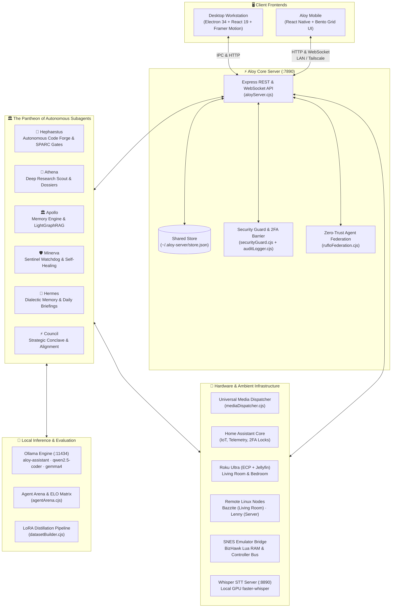

# 🛡️ Aloy Monorepo

> **Aloy**: A 100% local, autonomous personal AI assistant ecosystem designed for desktop, mobile, and ambient computing.

Aloy is a privacy-first, locally-hosted multi-agent platform that unifies desktop productivity, mobile orchestration, smart-home automation, media casting, and software engineering under a single sovereign architecture.

For specialized references:
- [**ARCHITECTURE.md**](./ARCHITECTURE.md) — Low-level present-tense architecture reference and subsystem contracts.
- [**CONTEXT.md**](./CONTEXT.md) — Canonical glossary and domain terminology.
- [**DECISIONS.md**](./DECISIONS.md) — Architectural rationale, incident post-mortems, and roadmap.

---

## 🏛️ System Architecture



---

## 🧩 Subsystems & Capabilities

### 1. ⚡ Unified Core Server & Zero-Trust Gateway (`apps/desktop/server/aloyServer.cjs`)
- **Single Source of Truth**: Runs on port **`7890`** (accessible locally, across Tailscale mesh, or via USB reverse-tethering). Both Desktop and Mobile read and write to the exact same canonical state store (`~/.aloy-server/store.json`) with atomic `.bak1`/`.bak2` rotation.
- **WebSocket Event Bus**: Broadcasts real-time events for subagent status, Jellyfin playback sessions, smart home state changes, and inbox notifications.
- **Zero-Trust Agent Federation**: P2P authenticated agent RPC across distributed nodes (Desktop $\leftrightarrow$ Mobile $\leftrightarrow$ Secondary nodes) featuring:
  - 4-tier trust model (`UNTRUSTED`, `VERIFIED`, `TRUSTED`, `PRIVILEGED`).
  - Cryptographic HMAC-SHA256 envelope signing with replay attack prevention.
  - Outbound PII and local directory path scrubbing pipeline (`%USERPROFILE%`, `~`, token redaction).
  - Hop limit circuit-breaker protection (`maxHops`) preventing runaway subagent delegation cascades.

---

### 2. 🏛️ The Pantheon of Autonomous Subagents

Aloy's intelligence is organized into specialized personas with distinct domain responsibilities:

| Subagent | Role | Primary Responsibilities |
| :--- | :--- | :--- |
| **🔨 Hephaestus** | *Code Forge* | Autonomous software engineering, AST parsing, unified diff application, self-healing runtime critiques, rollback snapshots, and Alpaca-formatted QLoRA distillation pair generation. |
| **🦉 Athena** | *Research Scout* | Deep autonomous web crawling, cross-source academic/technical synthesis, and structured Markdown research dossier production. |
| **🏛️ Apollo** | *Memory Engine* | Dual-tier episodic and semantic memory, **LightGraphRAG** entity extraction, knowledge graph querying, and 3-tier Markdown Obsidian Vault synchronization. |
| **🛡️ Minerva** | *Sentinel Watchdog* | Autonomous home server watchdog, real-time Docker/system health monitoring, automated process recovery, and smart-home execution supervisor. |
| **📜 Hermes** | *Briefing & Operations* | Dialectic memory integration, morning intelligence briefs, financial transaction categorization, budget threshold monitoring, and portfolio tracking. |
| **⚡ Pantheon Council** | *Strategic Conclave* | Joint cross-agent council evaluating system health, skill proficiency gaps, code backlogs, and user friction. |

---

### 3. 🛡️ SPARC 5-Phase Development Lifecycle & Quality Gates
*Harvested from `ruflo-sparc`*

Software development within Aloy's Code Forge follows a formal 5-phase quality gate lifecycle to eliminate hallucinations and code drift:

$$\text{Specification} \longrightarrow \text{Pseudocode} \longrightarrow \text{Architecture} \longrightarrow \text{Refinement} \longrightarrow \text{Completion}$$

- **Specification Gate**: Requires $\ge 3$ distinct acceptance criteria and explicit constraints.
- **Pseudocode Gate**: Enforces algorithmic flow verification and failure/edge case mapping.
- **Architecture Gate**: Validates module boundaries and affected file lists prior to implementation.
- **Refinement Gate**: Runs local test suites and verifies zero test failures before changes merge.
- **Completion Gate**: Verifies documentation updates and security audit sign-offs, generating GFM traceability reports.

---

### 4. ⚔️ Agent Arena & Strategy Tournaments
*Harvested from `ruflo-arena`*

- **Wolfram Competitive Matrix**: Evaluates agent prompt strategies across benchmark challenge suites.
- **Dynamic ELO Ratings**: Updates strategy ratings ($K=32$) based on deterministic head-to-head matches.
- **Prompt Hill-Climbing Co-Evolution**: Mutates prompt strategies across successive generations, evolving high-performing prompt variants.

---

### 5. 📺 Universal Media & Remote Machine Infrastructure
- **Universal Media Dispatcher (`mediaDispatcher.cjs`)**: Routes media playback across:
  - **Local PC**: Native MPV or default desktop media player.
  - **Living Room & Bedroom Roku Ultras**: Port 8060 External Control Protocol (ECP) with direct Jellyfin app deep-linking (`592369`) and fallback Roku Media Player streaming.
  - **Bazzite & Lenny**: Remote Linux gaming and server workstations via zero-overhead SSH command execution.
  - **Home Assistant Displays**: Google Nest Hub displays and smart TVs.
  - **Party Mode**: Broadcasts synchronized playback across all screens in the home.
- **Jellyfin Service (`jellyfinService.cjs`)**: Live WebSocket event tracking, library synchronization, remote playback control, and diagnostics.

---

### 6. 🏠 Ambient Smart-Home & Hardware Integration
- **Home Assistant Core**: Direct integration with lights, switches, climate thermostats, appliances, and presence sensors.
- **Hardware Security Barrier**:
  - **100% Confirmation Gate**: All state-mutating MCP tools, shell commands, and hardware controls require explicit user approval.
  - **2FA Exterior Lock Protection**: Exterior door locks and camera feeds are gated behind two-factor authentication.
  - **Least-Privilege Path Allowlist**: Read and write filesystem paths are strictly restricted by `securityGuard.cjs`.
- **SNES AI Emulator Bridge**: BizHawk Lua bridge supporting RAM inspection, memory watchpoints, and deterministic input sequencing.

---

## 📂 Repository Structure

```text
aloy/
├── apps/
│   ├── desktop/                      # Electron + React + Node.js backend
│   │   ├── src/                      # Desktop UI (React 19, Framer Motion, Tailwind)
│   │   │   ├── components/           # Dashboard, ChatArea, Sidebar, SubAgentsHub
│   │   │   └── services/             # Client tool registry (38+ tools), HA, API bridges
│   │   ├── server/                   # Core Node.js backend
│   │   │   ├── aloyServer.cjs        # Main Express & WebSocket API gateway (:7890)
│   │   │   ├── store.cjs             # Atomic JSON state store (~/.aloy-server/store.json)
│   │   │   ├── rufloFederation.cjs   # Zero-trust peer agent federation engine
│   │   │   ├── sparcLifecycle.cjs    # SPARC 5-phase quality gate lifecycle engine
│   │   │   ├── agentArena.cjs        # Agent strategy tournaments & ELO matrix
│   │   │   ├── mediaDispatcher.cjs   # Universal casting & Roku ECP dispatcher
│   │   │   ├── jellyfinService.cjs   # Jellyfin WebSocket & streaming service
│   │   │   ├── securityGuard.cjs     # Path allowlists, 2FA lock verification
│   │   │   └── trainer/              # LoRA distillation dataset builder (Alpaca JSONL)
│   │   └── bizhawk-lua/              # SNES emulator automation bridge
│   └── mobile/                       # React Native (Android / iOS) thin client
│       ├── src/                      # Mobile views, Bento grid widgets, status ticker
│       └── android/                  # Android native project files & standalone build assets
├── docs/                             # Architecture specifications, UX tokens, research dossiers
├── package.json                      # Monorepo workspace configuration
├── ARCHITECTURE.md                   # Detailed present-tense architecture reference
├── CONTEXT.md                        # Project glossary & naming conventions
├── DECISIONS.md                      # Architecture Decision Records (ADRs) & incident post-mortems
└── README.md                         # This repository overview
```

---

## 🌐 Network Topology & Port Allocations

| Port | Service | Protocol | Description |
| :---: | :--- | :---: | :--- |
| **7890** | Aloy Core Server | HTTP / WS | Primary REST API, WebSocket event bus, and agent federation gateway (`aloyServer.cjs`) |
| **8060** | Roku ECP | HTTP | External Control Protocol on local Roku Ultra streaming devices |
| **8081** | Metro Bundler | HTTP | React Native JavaScript bundler for Aloy Mobile development |
| **8096** | Jellyfin Media Server | HTTP / WS | Local streaming media server managed by `jellyfinService.cjs` |
| **8765** | Mindwalk 3D Visualizer | HTTP / WS | 3D codebase visualizer & session replay adapter (`mindwalkAdapter.cjs`) |
| **8890** | Whisper STT Server | HTTP | Local GPU faster-whisper speech-to-text sidecar |
| **8892** | News Scraper Server | HTTP | Python Scrapling sidecar for autonomous intelligence gathering |
| **11434** | Ollama Engine | HTTP | Local LLM inference (`aloy-assistant`, `qwen2.5-coder:14b`, `gemma4:12b`) |

---

## 🚀 Development & Verification

### Running the Stack

```bash
# Run server + Vite desktop development server
npm run dev

# Run Aloy Core Server standalone (port 7890)
npm run dev:server

# Launch desktop app with Electron shell
npm run electron:dev

# Start React Native Metro bundler for mobile (port 8081)
npm run dev:mobile

# Build and deploy standalone Android bundle to device
npm run android
```

### Packaging Desktop Updates

The desktop application runs from `%LOCALAPPDATA%\Programs\Aloy\resources\app.asar`. Whenever editing frontend or server code for the desktop app:

```bash
# Compile Vite bundle and build app.asar
npm run pack:asar
```

### Running Test Suites

The test suite covers unit, integration, and security checks across all engines:

```bash
# Run all Vitest suites across the monorepo (44 test suites, 345+ passing tests)
npm test
```
