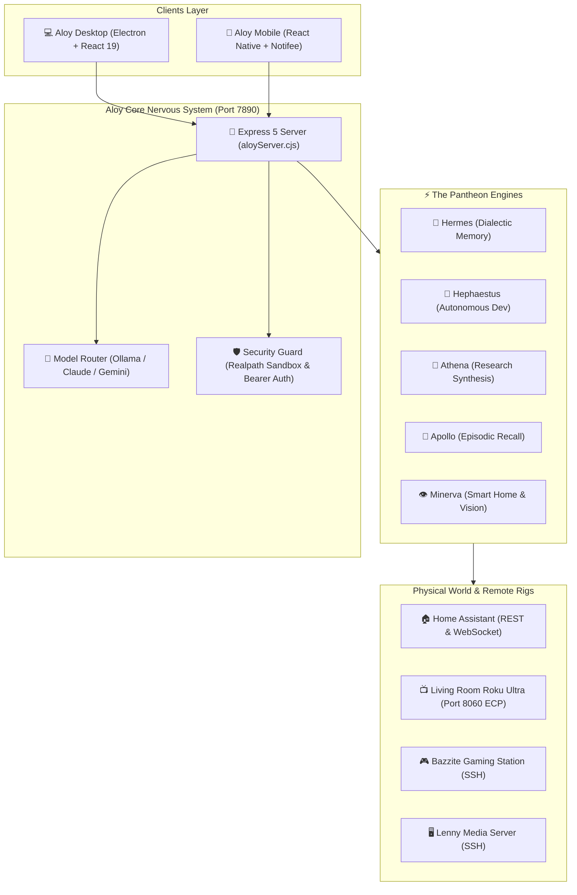

import { Tabs, TabItem } from '@astrojs/starlight/components';
import ArchifyDiagram from '../../../components/ArchifyDiagram.astro';

Aloy operates as a distributed, local-first system spanning your primary workstation, mobile device, smart home, and remote Linux servers.

<ArchifyDiagram title="Interactive Distributed Nervous System" />

## Distributed Topology

:::tip[Architectural Rule]
The Aloy Mobile app is a thin client that connects directly to `aloyServer.cjs` over Tailscale/LAN. Chat threads, memory vaults, and tool executions are strictly owned by the primary server.
:::
