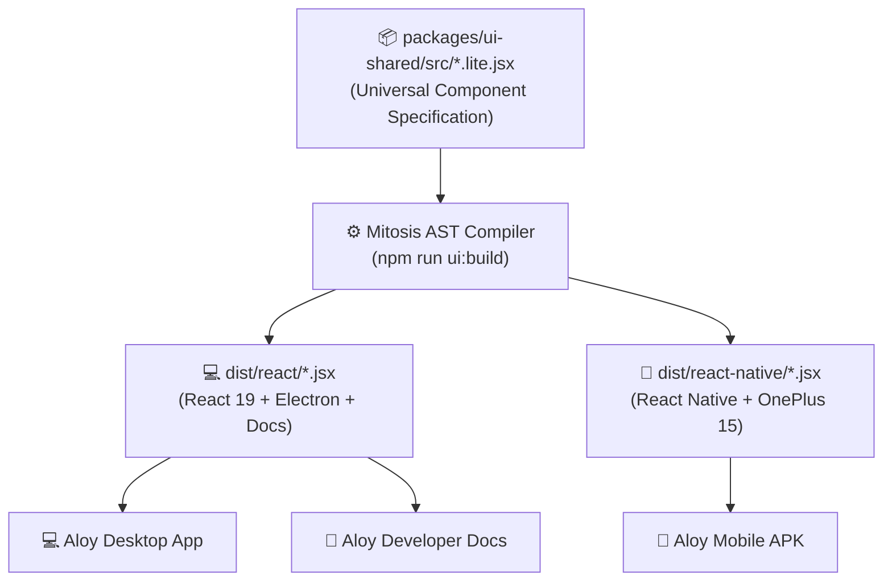

import { Tabs, TabItem } from '@astrojs/starlight/components';

Aloy uses **[Builder.io Mitosis](https://github.com/BuilderIO/mitosis)** within `packages/ui-shared` to maintain a single source of truth for all Bento Grid tiles, metric gauges, and agent-generated UI components.

## Topology



## Universal Component Suite

The following primitives are defined once in `packages/ui-shared/src/` and compiled for both web DOM and native mobile:

1. **`BentoTile`**: Glassmorphism container with status pills, header actions, and responsive content slots.
2. **`StatusBadge`**: Dynamic pulsing online/offline/busy health indicator.
3. **`MetricPill`**: Compact metric counter (e.g. GPU Temp, Token Savings, Library Counts).
4. **`QuickActionButton`**: Unified touchable button with primary/secondary styles.

## Compilation Command

To recompile all universal components across the monorepo:

```bash
npm run ui:build
```
