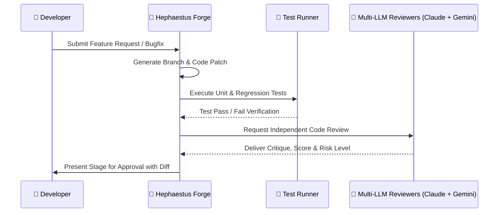

Hephaestus is Aloy's autonomous engineering forge. It generates code modifications in isolated workspace branches, verifies changes against automated test suites, and orchestrates multi-agent peer reviews.

## Review Pipeline

