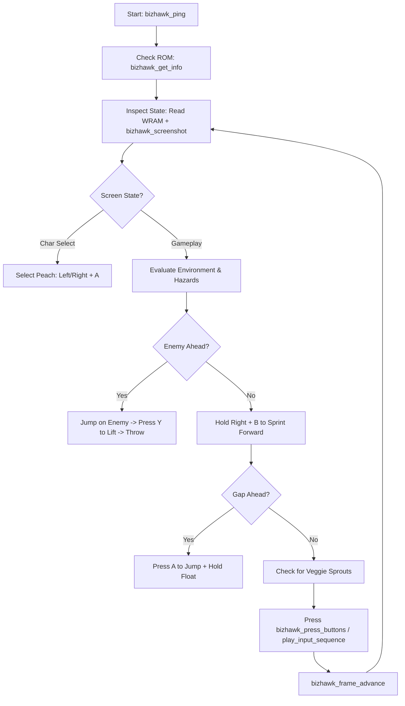

# Teaching Aloy How to Play Super Mario Bros. 2 (SNES) via RetroBat & MCP

This guide teaches **Aloy** (AI Agent) how to play **Super Mario Bros. 2** (Super Nintendo / Super Mario All-Stars version) using **RetroBat**, **BizHawk**, and the **`snes-emulator-bridge` (`mcp-bizhawk`) MCP server**.

---

## 1. System Architecture & Communication Flow

```
┌────────────────────────┐      stdio      ┌──────────────────────────┐     TCP :8766     ┌────────────────────────┐
│  Aloy (AI Agent)       │ ──────────────> │   snes-emulator-bridge   │ <───────────────> │  BizHawk (SNES Core)   │
│  (Calls bizhawk_* tools)│  JSON-RPC MCP   │   (Node.js / mcp-bizhawk)│   Newline-JSON   │  (Runs bridge.lua)     │
└────────────────────────┘                 └──────────────────────────┘                   └────────────────────────┘
```

- **RetroBat**: Launches BizHawk (`EmuHawk.exe`) with the SNES ROM `C:\RetroBat\roms\snes\Super Mario All-Stars.zip`.
- **MCP Server (`snes-emulator-bridge`)**: Configured in `mcp_config.json`, runs `mcp-bizhawk` and listens on TCP port `8766`.
- **BizHawk Lua Bridge (`lua/bridge.lua`)**: Runs inside BizHawk's Lua console. Every frame (~16ms), it polls port `8766`, processes input/memory RPCs from Aloy, and returns results.

---

## 2. Launch & Setup Instructions

### Step 1: Launch BizHawk with Socket Enabled
To connect BizHawk to the MCP bridge, launch EmuHawk with socket parameters:
```cmd
"%USERPROFILE%\BizHawk\EmuHawk.exe" --socket_ip=127.0.0.1 --socket_port=8766 "C:\RetroBat\roms\snes\Super Mario All-Stars.zip"
```

### Step 2: Load the Lua Bridge Script
Inside BizHawk:
1. Go to **Tools → Lua Console**.
2. Click **Open Script** and select:
   `%APPDATA%\npm\node_modules\mcp-bizhawk\lua\bridge.lua`
3. Console will output: `[mcp-bizhawk] frame loop active — bridge is polling once per frame`.

### Step 3: MCP Server Configuration
Ensure `~/.gemini/config/mcp_config.json` contains:
```json
{
  "mcpServers": {
    "snes-emulator-bridge": {
      "command": "mcp-bizhawk"
    }
  }
}
```

---

## 3. Aloy's MCP Tool Interface (`bizhawk_*`)

Aloy controls the emulator using these tools:

| MCP Tool | Purpose & Usage |
| :--- | :--- |
| `bizhawk_ping` | **Liveness check**. Call at start. Returns `"pong"` when connected. |
| `bizhawk_get_info` | **ROM inspection**. Returns loaded ROM name, hash, frame count, active memory domain (`WRAM`). |
| `bizhawk_list_memory_domains` | **Memory domain listing**. Returns `["WRAM", "VRAM", "CARTROM", "CARTRAM"]`. |
| `bizhawk_read8 / read16 / read32` | **Read RAM values** from `domain: "WRAM"`. Address offset e.g. `0x00F4` (Health). |
| `bizhawk_read_range` | **Bulk RAM read**. Read up to 4096 bytes of WRAM to parse level/object arrays. |
| `bizhawk_press_buttons` | **Set SNES Controller Input** for 1 frame. Buttons: `{"A": true, "Right": true}`. |
| `bizhawk_play_input_sequence` | **Batch Input Playback**. Execute multi-frame input macros with observation hooks (screenshots/RAM). |
| `bizhawk_frame_advance` | **Advance Emulation** by N frames (`count: 10`). |
| `bizhawk_screenshot` | **Capture Display PNG**. Saves screenshot to disk for visual analysis. |
| `bizhawk_save_state` / `load_state` | **Save & Restore State**. Create checkpoints before hard obstacles or boss battles. |

---

## 4. Super Mario Bros. 2 (SNES) Gameplay Mechanics

### Character Capabilities
1. **Princess Peach (Recommended for Beginners)**:
   - **Float Jump**: Hold Jump (`A` or `B`) in mid-air to float horizontally for ~1.5 seconds. Great for long gap crossings.
2. **Toad**:
   - **Fastest Pulling & Running**: Plucks veggies and carries items faster than anyone. Fast sprint while carrying. Short jump.
3. **Luigi**:
   - **High Flutter Jump**: Jumps highest with a flutter. Flips slightly slippery on landing.
4. **Mario**:
   - **Balanced**: Standard jump, speed, and pull rate.

### Core Rules & Controls
- **Plucking Veggies / Items**: Stand over a sprout → Press & hold `B` or `Y`.
- **Running / Carrying**: Hold `B` or `Y` to run or hold a plucked item/enemy.
- **Throwing**: Release or press `B` or `Y` while carrying an item to throw it horizontally.
- **Defeating Enemies**: Jumping on enemies **does NOT kill them**. Aloy must:
  1. Jump on top of an enemy (Shy Guy, Tweeter) to stand on it.
  2. Press `B`/`Y` to pick up the enemy!
  3. Throw the enemy into another enemy, obstacle, or boss.
- **Sub-Space (Potions & Mushrooms)**:
  - Pluck a Potion → Throw it to spawn a Red Door → Press `Up` to enter Sub-Space.
  - Pluck sprouts in Sub-Space to collect **Coins** and **Super Mushrooms** (permanently increases max hearts for the stage up to 4).
- **Boss Mechanics**:
  - **Birdo**: Catch thrown eggs mid-air (jump on egg, press `B`/`Y` to lift) → Throw back at Birdo (3 hits).
  - **Mouser**: Catch lit bombs before they detonate → Throw back at Mouser's platform (3 hits).
  - **Wart**: Machine spits vegetables → Catch veggies → Throw into Wart's open mouth when he opens it to spit bubbles (6 hits).

---

## 5. SNES WRAM Memory Map (Super Mario All-Stars - SMB2)

Aloy uses `bizhawk_read8` with `domain: "WRAM"` to read memory addresses directly:

| Address | Description | Values & Meaning |
| :--- | :--- | :--- |
| `0x0010` | Game Mode / Screen State | `0x00` = Title, `0x01` = Char Select, `0x02` = Gameplay, `0x03` = Game Over |
| `0x008A` | Current Character | `0` = Mario, `1` = Luigi, `2` = Princess Peach, `3` = Toad |
| `0x00ED` | Current World | `0` = World 1, `1` = World 2, ..., `6` = World 7 |
| `0x00EE` | Current Stage | `0` = Stage 1, `1` = Stage 2, `2` = Stage 3 |
| `0x00F4` | Current Health (Hearts) | `0` = Dead, `1` = 1 Heart, `2` = 2 Hearts, `3` = 3 Hearts, `4` = 4 Hearts |
| `0x00F5` | Max Health (Hearts) | Base = `2`, Max = `4` |
| `0x009C` | Player X Position (High) | Coarse horizontal position |
| `0x009D` | Player X Position (Low) | Fine horizontal position |
| `0x009E` | Player Y Position (High) | Coarse vertical position |
| `0x009F` | Player Y Position (Low) | Fine vertical position |
| `0x00C0` | Player X Velocity | Signed speed (-128 to 127) |
| `0x00C1` | Player Y Velocity | Jump/Falling speed |
| `0x04C0` | Player Action State | `0` = Standing, `1` = Walking, `2` = Jumping, `3` = Plucking, `4` = Carrying |
| `0x04E0` | Held Item ID | `0` = Empty, `1` = Veggie, `2` = Heavy Veggie, `3` = Bomb, `4` = Potion, `5` = Shell, `6` = Key |
| `0x060C` | Sub-Space Active Flag | `0` = Main World, `1` = Inside Sub-Space |
| `0x0625` | Coin Count | Total coins collected for end-stage slot machine |

---

## 6. Aloy's Agent Execution Loop (Step-by-Step)



### Action Loop Code Example for Aloy:
1. **Liveness & ROM Probe**:
   - `bizhawk_ping()` → Ensure response is `"pong"`.
   - `bizhawk_get_info()` → Ensure `rom_name` contains `"Super Mario All-Stars"`.
2. **State Monitoring**:
   - Read Health: `bizhawk_read8({domain: "WRAM", address: 0x00F4})`.
   - Read X/Y position: `bizhawk_read16({domain: "WRAM", address: 0x009C})`.
3. **Movement & Action Execution**:
   - To walk right: `bizhawk_press_buttons({buttons: {"Right": true, "Y": true}})`
   - To jump & float with Peach: `bizhawk_press_buttons({buttons: {"Right": true, "A": true}})` for 30 frames using `bizhawk_play_input_sequence`.
4. **Checkpointing**:
   - Before boss door (Birdo room): `bizhawk_save_state({path: "%USERPROFILE%/AloyFiles/smb2_stage1_1_checkpoint.State"})`.
   - If Health drops to 0: `bizhawk_load_state({path: "%USERPROFILE%/AloyFiles/smb2_stage1_1_checkpoint.State"})`.

---

## 7. Summary Checklist for Aloy

- [x] Launch EmuHawk with `--socket_ip=127.0.0.1 --socket_port=8766`.
- [x] Open Lua Console and load `bridge.lua`.
- [x] Verify MCP server connection via `bizhawk_ping`.
- [x] Character Select: Pick Princess Peach (Address `0x008A = 2`).
- [x] Monitor Health (`0x00F4`) and Position (`0x009C`, `0x009E`).
- [x] Pluck items with `B`/`Y`, lift enemies by jumping on top + `B`/`Y`.
- [x] Save states before bosses and load states on failure.
